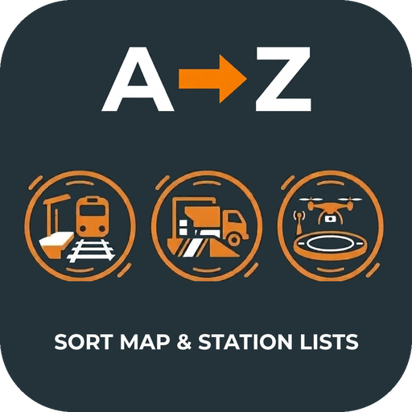
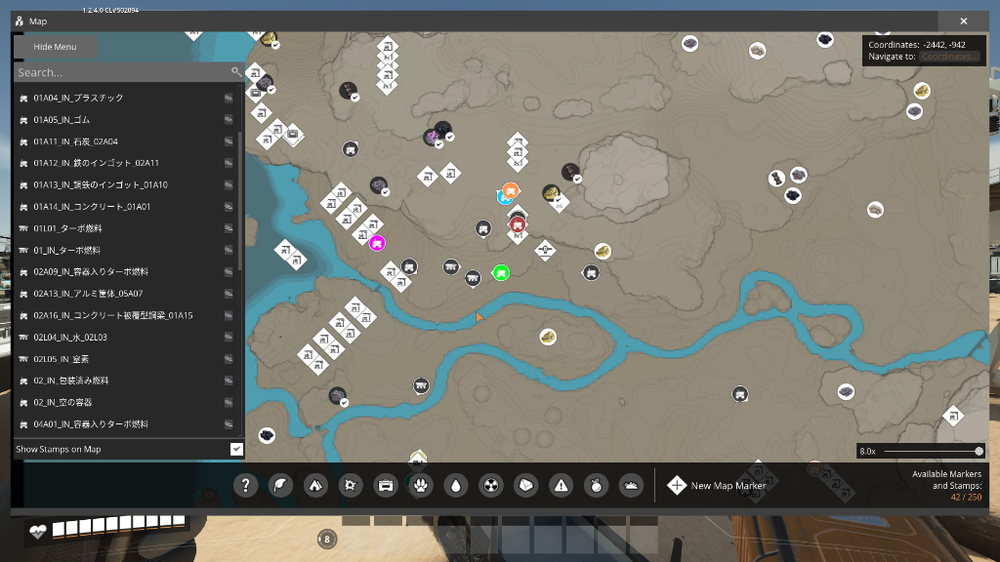

# Sorted Stations

  

  
  
  

**Sorted Stations** automatically organizes and sorts station names, available destinations, and drone ports in the management menus in **Satisfactory**. It also provides a seamless remote renaming and marker configuration system directly from the in-game Map.

Supports both standard **Unicode code-point order** and intuitive **Natural Sort Order** (handling numbers logically as `Station 1`, `Station 2`, `Station 10`).

  

---

## Features

### 1. Remote Renaming & Marker Settings (from Map Menu)
- **Edit Button (Pencil Icon)**: Adds a dedicated pencil icon next to each station, port, and vehicle in the in-game Map left-hand list.
- **Dedicated Edit Dialog**: Remotely change names, customize marker colors, and insert quick tags without physically traveling to the object.
- **Instant Re-Sorting**: Immediately re-sorts the Map list in real-time according to your active sort mode (Unicode / Natural) as soon as an object is renamed.

**Feature Support Matrix**:
| Target | Remote Renaming | Color Customization | Map List Auto-Sort |
| :--- | :---: | :---: | :---: |
| **Wheeled Vehicles** (Tractor, Truck, Explorer, Cyber Wagon) | ✅ Supported | ✅ Supported | ✅ Supported |
| **Trains** | ✅ Supported | ✅ Supported | ✅ Supported |
| **Train Stations** | ✅ Supported | ❌ Not Supported* | ✅ Supported |
| **Truck Stations** (Docking Stations) | ✅ Supported | ❌ Not Supported* | ✅ Supported |
| **Drone Stations** (Ports) | ✅ Supported | ❌ Not Supported* | ✅ Supported |
| **Drones** | ✅ Supported | ❌ Not Supported* | ✅ Supported |

*(Note: Due to base game specifications, dynamic color customization cannot be supported for Train Stations, Truck Stations, Drone Stations, and Drones. The color section is automatically hidden in the dialog for these objects).*

### 2. Multi-List Automatic Sorting
- **Map Left-Hand List**: Automatically organizes all stations, ports, and vehicles in the map management list.
- **Train Timetable Station Picker Sorting**: Available stations in the timetable picker are sorted by Unicode or natural sort order. (Your active route stop order is never modified).
- **Drone Port Search Sorting**: Available drone station destinations are organized and sorted for quick destination selection.

### 3. Custom Tag Insertion & Management
- Quick tag buttons (e.g., `_IN`, `_OUT`, `_To`, `_From`) append tags directly to the end of the name input field with a single click.
- In-dialog tag management allows adding and deleting up to 20 custom tags stored persistently.

---

## Sorting Modes Explained

| Mode | Logic | Example Sequence | Description |
| :--- | :--- | :--- | :--- |
| `0: None` | Vanilla (Disabled) | `Station B`, `Station A` (or distance) | Disables sorting for this category and preserves original game order |
| `1: Unicode` | Lexicographical | `Station 1`, `Station 10`, `Station 2` | Traditional code-point sort (Default) |
| `2: Natural` | Natural Sort | `Station 1`, `Station 2`, `Station 10` | Intelligent numeric sort for intuitive human-readable ordering |

---

## Configuration

> [!NOTE]
> **Default Setting & How to Change**:  
> By default, all categories are automatically configured to **Unicode** sort upon initial installation. If you wish to choose another pattern (such as Natural sort or None), please change the settings from the **Main Menu before loading your save game**.

1. From the Satisfactory **Main Menu** (before loading a save), go to **Mods** > **Sorted Stations**.
2. Adjust sorting modes for **Map List**, **Train timetable**, and **Drone timetable** as desired.
3. Load your save game to apply the changes.

| Setting Category | Values | Default | Description |
| :--- | :--- | :--- | :--- |
| **Map List** | None / Unicode / Natural | `Unicode` | Sort all stations, trains, and vehicles in the map left-hand list |
| **Train Timetable** | None / Unicode / Natural | `Unicode` | Sort available stations in the train timetable picker |
| **Drone Destinations** | None / Unicode / Natural | `Unicode` | Sort destination ports in the drone UI |

### Resetting Mod Data (In-Game Menu)

If you ever want to reset all stored custom tags and vehicle marker colors back to default:
1. Open the Satisfactory **Main Menu** (or in-game Pause Menu) and go to **Mods** > **Sorted Stations**.
2. Scroll down to the bottom of the configuration page to find the **Reset** button.
3. Clicking the button expands a confirmation prompt using Satisfactory's native localization system.
4. Click **Confirm** to safely reset all stored tags and vehicle colors to default values.

> [!NOTE]
> **Notice Regarding Existing Station & Vehicle Names**:  
> Resetting only clears the registered custom tag list and vehicle marker colors. Tags already appended to station or vehicle names remain intact as part of their names and will not be deleted.

---

## Multiplayer, Dedicated Server & Platforms

- **Sorting Features (all players, including guests)**:
  - **Client-Side Safe**: All sorting is purely local — only your own display list is reordered. No game state, network replication, or automation routes are affected.
  - Works in any multiplayer session or on a Dedicated Server **even if the host / server does not have this mod installed**. Each player with the mod gets sorted lists independently.

- **Remote Renaming & Color Customization (single-player / host only)**:
  - **Single-Player / Host**: Fully supported and saved normally.
  - **Guest players**: Renaming and color changes made by a guest are not replicated to the host or other players due to base game networking limitations. These features are intended for single-player or the session host.

- **Platform Compatibility (Steam Deck / Linux Proton)**:
  - Fully compatible with **Windows** and **Steam Deck / Linux** via Proton.

---

## Requirements

- **Satisfactory**: Update 1.2+ (CL#491125 or newer)
- **Satisfactory Mod Loader (SML)**: `^3.12.0`

---

## Changelog

### v1.0.1
* **New Feature: Remote Renaming from Map Menu**
  * Added a dedicated pencil button next to objects in the Map list. Remotely change names, customize marker colors, and append tags without traveling on-site.
* **New Feature: Vehicle Marker Color Customization**
  * Freely customize the map marker colors for wheeled vehicles (Tractor, Truck, Explorer, Cyber Wagon) and Trains.
* **New Feature: Quick Tag Insertion & Management**
  * Append common suffixes like `_IN` or `_OUT` with one click, and store up to 20 custom tags in persistent storage.
* **New Feature: In-Game Mod Data Reset**
  * Added a Reset button in the Mod Configuration menu to safely restore custom tags and vehicle colors to defaults (existing object names are preserved).
* **Usability & Behavior Improvements**
  * Renaming an object now immediately re-sorts the Map list in real-time without needing to close and reopen the map.
  * Selecting "None" sorting mode now properly preserves vanilla ordering upon renaming without unwanted sorting.
* **Performance & Stability Enhancements**
  * Enhanced stability during rapid Map open/close cycles, eliminating potential crashes.
  * Optimized reflection lookups with static caching, ensuring buttery-smooth map performance even in mega-factory worlds with hundreds of stations.

### v1.0.0
* **Initial Release**
  * Compatible with Satisfactory Update 1.2+ / SML 3.12+.
  * Automatic Map list sorting for train stations, truck stations, drone ports, trains, and vehicles.
  * Automatic sorting for train timetable station picker and drone destination list.
  * Supports both Unicode lexicographical sort and intuitive Natural Sort Order.
  * Per-category sort mode selection (None / Unicode / Natural).

---

## Bug Reports & Support

- Found a bug or have a suggestion? Open an issue on [GitHub Issues](https://github.com/CrescentAlpha/Sorted-Stations/issues).

---

## Author

- **Created by**: CrescentAlpha